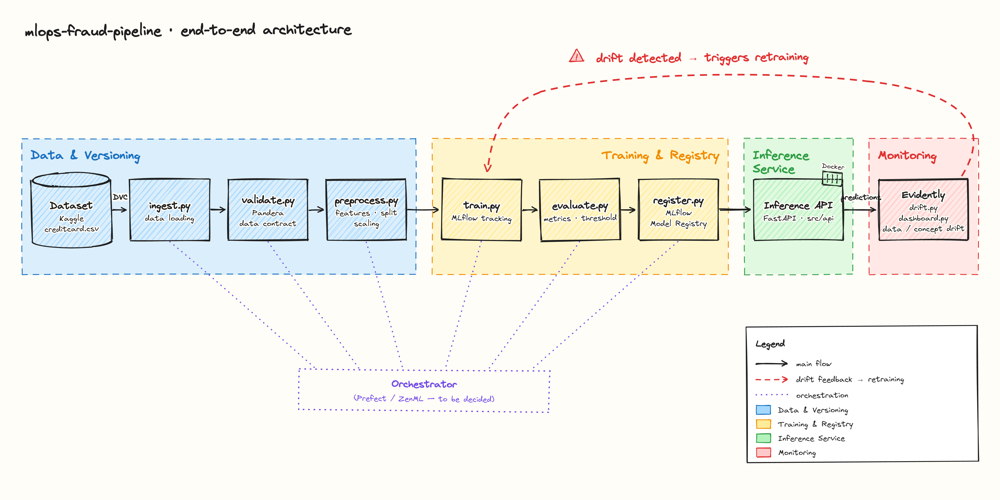

# Fraud MLOps Pipeline

**An end-to-end MLOps system for credit-card fraud detection that retrains itself when the world changes.**

This repository is not a model in a notebook — it is the *production system* around the model:
versioned data, tracked training, a model registry, a typed inference API, containers, CI/CD,
orchestration, and drift monitoring wired into a closed loop that **detects data drift and
triggers automatic retraining**. The fraud model is deliberately the least important part; the
engineering around it is the deliverable.

> **Project status:** 🟢 **Phases 0–1 complete** — foundations plus a versioned, validated,
> reproducible data pipeline (DVC + Pandera). Phases 2–9 are under active construction — see the
> [roadmap](#roadmap) below. This is a living project, built in gated phases, not an abandoned
> prototype.

---

## Architecture

The system runs on two clocks over the same infrastructure: a fast **prediction path**
(validate → preprocess → predict → **log every prediction** → respond, in milliseconds) and a
slow **model-lifecycle path** (logs analysed for drift → alert → automatic retrain → evaluate →
promote, over days/weeks). The closed drift → retrain loop is the centrepiece.



The same flow as a quick textual reference:

```
 raw data ─▶ ingest + validate (DVC, Pandera) ─▶ preprocess ─▶ train (MLflow) ─▶ Model Registry
                    ▲                                                                   │
                    │                                                                   ▼
              retrain (Prefect)                                                 FastAPI inference
                    ▲                                                                   │
                    │                                                          log every prediction
                    └────────── drift alert (Evidently) ◀── analyse prediction logs ◀───┘
```

---

## The problem — and why it matters

Card fraud is a **needle-in-a-haystack** problem: in this project's dataset, roughly **0.17% of
transactions are fraudulent** (492 in 284,807). That extreme imbalance makes accuracy a trap — a
model that flags *nothing* as fraud is still ~99.83% accurate and completely useless.

What makes it a *business* problem, not just a statistics problem, is the **cost asymmetry**
between the two ways of being wrong:

- A **false negative** (fraud let through) is direct, often unrecoverable financial loss.
- A **false positive** (a legitimate customer wrongly blocked) is friction, support cost, and
  eroded goodwill.

Because a missed fraud typically costs far more than a false alarm, the system is tuned to
**prioritise recall while controlling precision**, and is measured with **PR-AUC** rather than
the deceptively optimistic ROC-AUC. The decision threshold is treated as part of the model
artifact, tuned to the business cost trade-off rather than left at a naïve 0.5.

The full reasoning — metric choice, cost model, dataset limitations, and stack rationale — lives
in the design-decision records: **[`docs/decisions/`](docs/decisions/)**.

---

## Technology stack

Chosen for a reproducible, production-shaped system at portfolio scale — no Kubernetes, no
over-engineering. The **Phase** column shows when each tool enters the project; "✅ active" means
it is already wired up in the repository today (through Phase 1).

| Concern | Tool | Phase |
|---|---|---|
| Language | Python 3.14 | ✅ active |
| Environment & dependencies | **uv** (single lockfile, no manual venvs) | ✅ active |
| Lint **and** format | **ruff** (one tool — no black) | ✅ active |
| Git hooks | **pre-commit** (ruff, whitespace, large-file guard) | ✅ active |
| Testing | **pytest** | ✅ active |
| Exploration | **pandas · seaborn · matplotlib · Jupyter** | ✅ active |
| Data versioning | **DVC** (data never committed to Git) | ✅ active |
| Data validation | **Pandera** (schema as a quality contract) | ✅ active |
| Modelling | **scikit-learn / XGBoost** + **imbalanced-learn** | Phase 2 |
| Experiment tracking & Model Registry | **MLflow** | Phases 2–3 |
| Inference API | **FastAPI** + **Pydantic** | Phase 4 |
| Containerization | **Docker** + Docker Compose | Phase 5 |
| CI/CD | **GitHub Actions** (incl. a model-validation gate) | Phase 6 |
| Orchestration | **Prefect** | Phase 7 |
| Monitoring & drift | **Evidently** | Phase 8 |
| Deployment | **Render / Railway / Fly.io / Modal** (lightweight) | Phase 9 |

---

## Getting started

**Prerequisites:** [`uv`](https://docs.astral.sh/uv/) installed. uv manages the Python
interpreter (pinned to 3.14 in `.python-version`), the virtual environment, and all
dependencies — you do not need to create or activate a venv yourself.

```bash
git clone https://github.com/adrianmarchramon/fraud-mlops-pipeline.git
cd fraud-mlops-pipeline
make setup          # uv sync + install pre-commit hooks
```

`make setup` is the single entry point: it resolves the exact dependency set from `uv.lock` and
installs the git hooks. The rest of the interface is the Makefile:

```bash
make lint           # ruff check
make format         # ruff format
make test           # pytest
make train          # train the model             (available from Phase 2)
make serve          # run the FastAPI inference API (available from Phase 4)
```

### Getting the data

`make setup` prepares the *environment* but does **not** fetch the dataset — data is never
stored in Git. From Phase 1 the data is **DVC-managed**: `data/raw/creditcard.csv` and the
processed artifacts are tracked by DVC, with only the lightweight `.dvc` / `dvc.lock` pointers
committed to Git.

If you have access to the configured DVC remote, pull the tracked data — raw CSV, processed
`train`/`test` parquet, and the fitted `preprocessor.joblib` — in one step:

```bash
uv run dvc pull
```

> **Note:** the default DVC remote is currently a **local** store on the author's machine — a
> deliberate Phase 1 choice (see
> [`docs/decisions/0005-dvc-local-remote.md`](docs/decisions/0005-dvc-local-remote.md)). A clone
> on a different machine therefore cannot `dvc pull` until a shared/cloud remote is configured.

To reproduce the pipeline from scratch on any machine, fetch the raw CSV from
[Kaggle](https://www.kaggle.com/datasets/mlg-ulb/creditcardfraud) (with configured Kaggle API
credentials) and rebuild the versioned pipeline:

```bash
uv run kaggle datasets download -d mlg-ulb/creditcardfraud -p data/raw --unzip
uv run dvc repro
```

This places `creditcard.csv` in `data/raw/`, runs the versioned pipeline (validate → preprocess),
and regenerates `data/processed/{train,test}.parquet` and `preprocessor.joblib`. The exploration
notebook `notebooks/01_exploration.ipynb` also runs end to end once the raw CSV is present.

---

## Roadmap

The project is built in nine gated phases; each is finished only when its "Definition of Done"
passes before the next begins.

| Phase | Milestone | Status |
|---|---|---|
| 0 | Repo, environment, data understanding & decision log | ✅ Complete |
| 1 | Versioned data pipeline (DVC + Pandera) | ✅ Complete |
| 2 | Training + experiment tracking (MLflow) | ⏳ Planned |
| 3 | Model Registry & packaging | ⏳ Planned |
| 4 | Inference API (FastAPI) | ⏳ Planned |
| 5 | Containerization (Docker) | ⏳ Planned |
| 6 | CI/CD (GitHub Actions) | ⏳ Planned |
| 7 | Orchestration (Prefect) | ⏳ Planned |
| 8 | Monitoring, drift & closed retraining loop (Evidently) | ⏳ Planned |
| 9 | Deployment, final README & demo | ⏳ Planned |

---

## Repository layout

```
src/            # all production code, as an importable package
  data/         # ingest, validate (Pandera), preprocess
  models/       # train, evaluate, register (MLflow)
  api/          # FastAPI app, Pydantic schemas, prediction logic
  monitoring/   # drift detection (Evidently), dashboard
  config.py     # centralized configuration
pipelines/      # Prefect orchestration flows (kept separate from src/)
tests/          # test_data, test_model, test_api
notebooks/      # exploration only — never production code
docs/decisions/ # design-decision records (ADRs)
docker/         # Dockerfile, docker-compose
data/           # DVC-managed, not in Git
```

---

## License

Released under the [MIT License](LICENSE).
