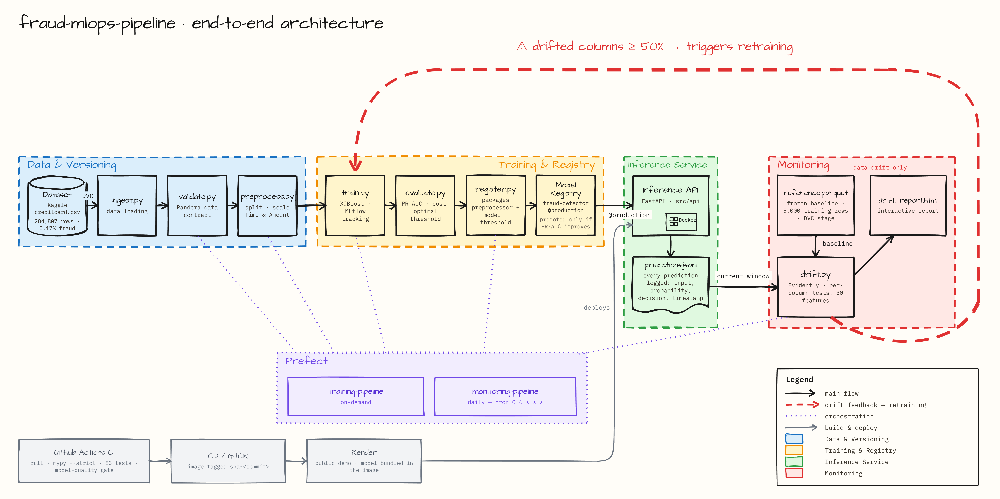

# Fraud MLOps Pipeline

[](https://github.com/adrianmarchramon/fraud-mlops-pipeline/actions/workflows/ci.yml)
[](https://fraud-detection-api-unsm.onrender.com/docs)
[](https://www.python.org/)
[](https://github.com/adrianmarchramon/fraud-mlops-pipeline/pkgs/container/fraud-mlops-pipeline)
[](LICENSE)

**An end-to-end MLOps system for credit-card fraud detection that notices when its own input data
has drifted and retrains itself — with no human in the path.**

This is not a model in a notebook. It is the *production system* around the model: versioned data,
tracked training, a model registry with a promotion gate, a typed inference API, containers,
CI/CD, orchestration, and drift monitoring wired into a closed loop. The fraud model is
deliberately the least interesting part; the engineering around it is the deliverable.

**→ Try it live: [fraud-detection-api-unsm.onrender.com/docs](https://fraud-detection-api-unsm.onrender.com/docs)**

**→ [▶ Watch the 20-second introduction](docs/videos/project_resume.mp4)** — what the system is,
at a glance. The loop it describes is walked through in full [further down](#the-closed-loop-drift--retrain).

---

## Contents

[Try it in 30 seconds](#try-it-in-30-seconds) · [Why this project](#why-this-project) ·
[Architecture](#architecture) · [Results](#results) ·
[The closed loop](#the-closed-loop-drift--retrain) · [Design decisions](#design-decisions) ·
[Run it yourself](#run-it-yourself) · [How it is deployed](#how-it-is-deployed) ·
[What I would do differently](#what-i-would-do-differently) · [Roadmap](#roadmap)

---

## Try it in 30 seconds

The API is live. This is a **known fraudulent transaction** from the dataset:

```bash
curl -X POST https://fraud-detection-api-unsm.onrender.com/predict \
  -H "Content-Type: application/json" \
  -d '{"Time": 406.0,"V1": -2.312227,"V2": 1.951992,"V3": -1.609851,"V4": 3.997906,"V5": -0.522188,"V6": -1.426545,"V7": -2.537387,"V8": 1.391657,"V9": -2.770089,"V10": -2.772272,"V11": 3.202033,"V12": -2.899907,"V13": -0.595222,"V14": -4.289254,"V15": 0.389724,"V16": -1.140747,"V17": -2.830056,"V18": -0.016822,"V19": 0.416956,"V20": 0.126911,"V21": 0.517232,"V22": -0.035049,"V23": -0.465211,"V24": 0.320198,"V25": 0.044519,"V26": 0.17784,"V27": 0.261145,"V28": -0.143276,"Amount": 0.0}'
```

```json
{"fraud_probability": 0.9997079968452454, "is_fraud": 1, "model_version": "1"}
```

And a **legitimate** one — same endpoint, same model:

```bash
curl -X POST https://fraud-detection-api-unsm.onrender.com/predict \
  -H "Content-Type: application/json" \
  -d '{"Time": 0.0,"V1": -1.359807,"V2": -0.072781,"V3": 2.536347,"V4": 1.378155,"V5": -0.338321,"V6": 0.462388,"V7": 0.239599,"V8": 0.098698,"V9": 0.363787,"V10": 0.090794,"V11": -0.5516,"V12": -0.617801,"V13": -0.99139,"V14": -0.311169,"V15": 1.468177,"V16": -0.470401,"V17": 0.207971,"V18": 0.025791,"V19": 0.403993,"V20": 0.251412,"V21": -0.018307,"V22": 0.277838,"V23": -0.110474,"V24": 0.066928,"V25": 0.128539,"V26": -0.189115,"V27": 0.133558,"V28": -0.021053,"Amount": 149.62}'
```

```json
{"fraud_probability": 0.000024124205083353445, "is_fraud": 0, "model_version": "1"}
```

Or open **[/docs](https://fraud-detection-api-unsm.onrender.com/docs)** and send one from the
browser — the Swagger UI is generated from the Pydantic schemas, so it cannot drift from what the
API actually accepts.

> **⏳ The first request may take up to two minutes. This is normal — the link is not broken.**
> The service runs on a free tier that sleeps after a period without traffic. Measured: after
> several hours idle, the first request took **111 seconds** to wake the container; after that,
> every request is around **0.3 s**. A short idle does not trigger it — after 17 minutes the
> service was still warm. If your first `curl` seems to hang, leave it running.
>
> **The public URL is the serving half of the system, not the whole of it.** The drift-detection
> and retraining loop needs MLflow, Prefect and the dataset, so it runs locally and is shown in
> the demo video. The deployed API does not retrain itself; the system does, where it can.

---

## Why this project

Card fraud is a **needle-in-a-haystack** problem. In this dataset, **492 of 284,807 transactions
are fraudulent — 0.17%**. That imbalance makes accuracy a trap: a model that flags *nothing* is
99.83% accurate and completely worthless.

What makes it a *business* problem rather than a statistics exercise is the **cost asymmetry**:

- A **false negative** — fraud let through — is direct, usually unrecoverable financial loss.
- A **false positive** — a real customer blocked — is friction, support cost and lost goodwill.

A missed fraud costs roughly **34× a false alarm** under this project's cost model, so the system
is tuned to **maximise recall while keeping precision usable**, measured with **PR-AUC** rather
than the deceptively flattering ROC-AUC, and its decision threshold is chosen by **expected
business cost** rather than left at a naïve 0.5.

But the harder problem is the one that shows up three months later: a model that keeps returning
`200 OK` and quietly stops catching fraud, because the world moved and nobody noticed. **That** is
what this repository is actually about.

---

## Architecture



The system runs **two clocks on the same infrastructure**:

- The **prediction path**, in milliseconds — validate → preprocess → predict → **log the
  prediction** → respond.
- The **model-lifecycle path**, over days — logs analysed for drift → alert → automatic retrain →
  evaluate → promote only if better.

Every prediction the API serves is appended to a JSONL log. That log is not an afterthought: it is
the raw material the monitoring half consumes, and its format was frozen as a contract in Phase 4
*specifically* so Phase 8 could read it.

```
 raw data ─▶ ingest + validate (DVC, Pandera) ─▶ preprocess ─▶ train (MLflow) ─▶ Model Registry
                    ▲                                                                   │
                    │                                                                   ▼
              retrain (Prefect)                                                 FastAPI inference
                    ▲                                                                   │
                    │                                                          log every prediction
                    └────────── drift alert (Evidently) ◀── analyse prediction logs ◀───┘
```

### The stack, and when each piece entered

| Concern | Tool | Since |
|---|---|---|
| Language · env · deps | Python 3.12, **uv** (one lockfile, no manual venvs) | Phase 0 |
| Lint **and** format | **ruff** (one tool — no black) | Phase 0 |
| Data versioning | **DVC** (data never enters Git) | Phase 1 |
| Data validation | **Pandera** (schema as a quality contract) | Phase 1 |
| Modelling | **scikit-learn / XGBoost** + imbalanced-learn | Phase 2 |
| Tracking · Registry | **MLflow** (SQLite backend, versions + aliases) | Phases 2–3 |
| Inference API | **FastAPI** + **Pydantic** + Uvicorn | Phase 4 |
| Containers | **Docker** (multi-stage, non-root) + Compose | Phase 5 |
| CI/CD | **GitHub Actions** + **GHCR**, incl. a model-quality gate | Phase 6 |
| Orchestration | **Prefect** (flows, retries, cron, event triggers) | Phase 7 |
| Monitoring & drift | **Evidently** (data drift, HTML reports, threshold alerts) | Phase 8 |
| Deployment | **Render** (free tier, prebuilt image) | Phase 9 |

No Kubernetes. That is a deliberate, defensible choice at this scale, not an omission — see
[the design decisions](#design-decisions).

---

## Results

The model is **XGBoost**, chosen on PR-AUC over a logistic-regression baseline (0.876 vs 0.725),
with `scale_pos_weight` handling the imbalance and a decision threshold of **0.03** selected by
minimising expected business cost.

| Metric | Value |
|---|---|
| **PR-AUC** (primary) | **0.876** |
| Recall | 0.888 |
| Precision | 0.554 |
| F1 | 0.682 |

These come from [`reports/metrics.json`](reports/metrics.json), which is versioned in Git by DVC
and **read by CI on every pull request** — a build fails if PR-AUC drops below the floor. The
numbers in this table are therefore checked by machine, not copied by hand.

**Read them in business terms.** At this operating point the system catches **89% of fraud** and
about **45% of its alerts are false alarms**. That trade is deliberate: with a false negative
costing ~34× a false positive, tolerating false alarms to catch more fraud is the cheaper
mistake. At the naïve 0.5 threshold the same model would cost noticeably more.

> The cost figures behind the threshold (€137 per missed fraud, €4 per false alarm) are
> **illustrative, not measured business data**. The first is the dataset's mean fraud amount plus
> a handling estimate; the second is the midpoint of a plausible range. Every decision resting on
> them — the threshold above all — inherits that caveat. They live in
> [`params.yaml`](params.yaml) as versioned parameters precisely so they can be replaced with real
> numbers without touching a line of code.

---

## The closed loop (drift → retrain)

This is the part that makes it a system rather than a deployment, and it has been **watched
running end to end, twice**.

A model does not fail loudly. It keeps answering, keeps returning probabilities, and quietly stops
catching fraud as reality drifts away from what it learned. So the pipeline measures that drift
directly:

- One side is a **frozen reference** — 5,000 rows from the training split, in raw feature space,
  built by its own DVC stage so the baseline has a hash and two runs a month apart are answering
  the same question.
- The other is **real traffic** — the prediction log the API has been appending to since Phase 4.
- Evidently runs a per-column statistical test across all 30 features. When the share of drifted
  columns reaches the threshold, an alert fires and the **training deployment is triggered**.

Here is the loop actually firing, from the run recorded in
[ADR 0041](docs/decisions/0041-phase-8-closure.md):

```
20:47:12  BEFORE   3 records in the log  ->  detect_drift() = False
                   "below the 100-row minimum" — it declines to guess
20:47:47  INJECT   300 shifted transactions POSTed to the live API   (300/300 accepted)
                   Amount mean 2910.20 vs 87.86 reference | V1 mean 3.080 vs 0.010
20:47:54  TRIGGER  monitoring flow runs
20:48:02           Drift detected? True   (100% of columns drifted)
20:48:02           DRIFT ALERT: Significant drift detected. Triggering retraining.
20:48:02           training flow created — source=deployment
20:48:11           validate -> 284,807 rows OK
20:48:12           preprocess -> done
20:48:19           train -> done
20:48:20           register -> fraud-detector v8 created
20:48:21           Completed
```

**Nobody touched anything between the first HTTP request and v8.** The `False` twenty seconds
before the `True` matters as much as the `True` — it is the guard refusing to call drift on three
rows, which is what shows the detection came from the injected batch rather than from a detector
that reports drift on anything.

And v8 was **not promoted**. Training is deterministic on unchanged data, so the new model tied
the incumbent, and the promotion gate requires *strictly better* PR-AUC. **A gate that refuses an
equal model is a gate that works** — seven registered versions now sit unpromoted for exactly this
reason.

Every check also writes an interactive **HTML report** to `reports/drift/drift_report.html`: one
section per feature, reference and current distributions overlaid, per-column test results. It is
the most legible artifact the project produces.

**What this measures, and what it does not.** This is **data drift** — a change in the input
distribution, P(X). It is deliberately *not* concept drift, a change in the relationship between
features and outcome, because measuring that needs ground truth this system never receives: in
fraud you learn a transaction was fraudulent days or weeks later, when the chargeback arrives.
That **label delay** is precisely why input drift is worth acting on — it is the signal that
arrives while there is still time to react.

---

## Design decisions

Code shows you can execute; design decisions show you can *think*. This project keeps
**[43 decision records](docs/decisions/)**, each written when the decision was made, with the
alternatives that were rejected and the measurements that settled it. A selection:

**[PR-AUC, not ROC-AUC](docs/decisions/0001-business-metric.md).** Under 0.17% positives, ROC-AUC
is dominated by the true-negative mass and stays flatteringly high for a model that is barely
working. Precision-recall says something about the minority class, which is the only class anyone
cares about here.

**[The threshold is part of the model, not the API](docs/decisions/0014-cost-optimal-threshold.md).**
It is derived from expected business cost, versioned in `params.yaml`, and packaged *inside* the
registered artifact. An API that hardcoded `0.5` would silently decouple the served decision from
the one that was evaluated.

**[Preprocessing ships with the model](docs/decisions/0015-packaged-model-contract.md).** The
artifact is one `pyfunc` carrying the fitted preprocessor, the booster and the threshold, so the
API feeds it *raw* transactions. This is the single most important defence against
**training-serving skew** — the failure where the API reimplements feature engineering slightly
differently from training, and nothing ever errors.

**[Aliases, not stages](docs/decisions/0016-promotion-quality-gate.md).** Consumers ask for
`@production`, never a version number. Promoting is one alias move, and the API serves the new
model after a restart with no code change — and only if the candidate **beats** the incumbent on
PR-AUC.

**[Validate at every boundary, fail loudly](docs/decisions/0010-pandera-strict-lazy.md).** Pandera
gates data into training; Pydantic gates requests into the API. Bad input produces a `422`, never
a confident prediction on garbage.

**[Log every prediction from day one](docs/decisions/0021-prediction-log-and-api-tests.md).** The
record shape was frozen in Phase 4 as an explicit contract with a monitoring phase that did not
exist yet. Phase 8 read it unchanged. Monitoring is not something you add later; it is something
you leave room for.

**[The CI gate tests the model, not just the code](docs/decisions/0028-model-quality-gate-threshold.md).**
A green test suite says nothing about whether the model still works. A dedicated test reads the
DVC-versioned PR-AUC and fails the build if it has degraded.

**[The health check inspects the body, not the status code](docs/decisions/0022-container-image-contract.md).**
`/health` returns `200` even with no model loaded — reporting the degraded state is its job — so
`curl -f` would call a broken container healthy. This bit once, for real, and the fix is recorded.

**[No Kubernetes](docs/decisions/0004-stack-summary.md).** One service with light traffic does not
need an orchestrator; adding one would demonstrate tool familiarity and poor judgement
simultaneously. A lightweight PaaS with a health check and rolling deploys is the right size.

**[The public deployment bundles its model](docs/decisions/0042-bundled-model.md).** A free tier
has no MLflow server to resolve an alias against, so the artifact ships inside the image, selected
by one environment variable. Local and Compose runs are untouched and still resolve the alias —
one variable, a working default, no second code path.

---

## Run it yourself

**Prerequisites:** [`uv`](https://docs.astral.sh/uv/). It manages the interpreter, the virtualenv
and every dependency — you never create or activate a venv yourself.

```bash
git clone https://github.com/adrianmarchramon/fraud-mlops-pipeline.git
cd fraud-mlops-pipeline
make setup            # uv sync + install pre-commit hooks
make test             # 83 tests
```

The Makefile is the interface:

```bash
make lint / format    # ruff (linter AND formatter)
make train            # train, logging the run to MLflow
make register         # register the best run; promote it only if it beats production
make serve            # FastAPI on http://localhost:8000
```

**Want the API running immediately, with no dataset and no MLflow?** A copy of the production
model ships in the repository, so a fresh clone can serve real predictions straight away:

```bash
MODEL_PATH=deploy/model uv run uvicorn src.api.main:app --port 8000
```

Verified from a clean clone: `/health` reports `ok`, `/model-info` reports version 1, and
`/predict` returns the same probabilities the live service does. Without `MODEL_PATH` the API
resolves the `@production` alias from a Model Registry instead — which is what `make serve`,
Compose and every test do, and why a promotion changes what they serve with no rebuild.

### Getting the data

`make setup` prepares the environment but **not** the dataset — data never lives in Git. Fetch it
from Kaggle and rebuild the whole versioned pipeline:

```bash
uv run kaggle datasets download -d mlg-ulb/creditcardfraud -p data/raw --unzip
uv run dvc repro      # validate -> preprocess -> train -> reference
```

`dvc repro` re-runs only the stages whose dependencies actually changed, so editing a
hyperparameter retrains the model without recomputing the data.

> The configured DVC remote is a **local** store on the author's machine
> ([why](docs/decisions/0005-dvc-local-remote.md)), so `dvc pull` will not work from a fresh clone
> elsewhere — rebuild from Kaggle as above.

### The whole system in containers

```bash
docker compose -f docker/docker-compose.yml up
```

Brings up the API (`:8000`) and MLflow (`:5000`) on one network, the API finding the registry by
service name. Registered models live in a named volume and survive `docker compose down`. The
published image can also be pulled directly:

```bash
docker pull ghcr.io/adrianmarchramon/fraud-mlops-pipeline:latest
```

### Watching the loop run

Four terminals, and you can watch a model retrain itself:

```bash
make prefect-server   # dashboard on http://localhost:4200
make prefect-serve    # serves both deployments; leave running
make serve            # the API
make simulate-drift   # POST 300 deliberately shifted transactions
make prefect-monitor  # run the drift check now instead of waiting for 06:00
```

The monitoring flow reads the log, measures the shift, fires the alert, and triggers the training
deployment. Watch it in the Prefect dashboard; read
`reports/drift/drift_report.html` afterwards.

---

## How it is deployed

Two workflows, deliberately split. **[`ci.yml`](.github/workflows/ci.yml)** runs on every pull
request: `uv sync --locked` (which fails if the lockfile drifted), `ruff check`,
`ruff format --check`, `mypy --strict`, then the full suite including the model-quality gate.
`main` is protected — a PR cannot merge until that job is green.
**[`cd.yml`](.github/workflows/cd.yml)** then fires only on merges, building the image and
publishing it to GHCR tagged `latest`, `main`, and `sha-<commit>`.

The public service deploys **that exact image**, pinned by its immutable `sha-` tag in
[`render.yaml`](render.yaml) — build once, deploy anywhere, and always able to say which build is
live. Because a free tier has no MLflow to query, the API loads a model bundled in the image,
selected by `MODEL_PATH`; everything else keeps resolving the `@production` alias.

---

## What I would do differently

The honest list, and most of it is already written down in the decision records.

**The DVC remote is local**, which means this repository is reproducible on my machine and not on
yours. It was the right call for a solo project with a 150 MB dataset and no cloud budget, and it
is the first thing I would change with a bucket available.

**Drift detection is only half of monitoring.** The system measures input drift because that is
the signal it can actually get. Real fraud systems eventually receive labels via chargebacks, and
the natural next step is a delayed-label pipeline that measures *performance* decay rather than
inferring it from input distributions.

**The retrained model has never been promoted**, because retraining on unchanged data
deterministically ties the incumbent. The loop is proven; what it has not yet demonstrated is a
promotion driven by genuinely new data. That needs a data source that actually moves.

**The alert's webhook path has never reached a real endpoint.** Logging always works and is
tested; the Slack/Discord POST has only ever been exercised against an unreachable address to
verify the failure path. It is honest to call that unproven.

**The measured drift share never reaches the Prefect dashboard.** It is logged at INFO on a module
logger under a root logger left at WARNING, so the dashboard shows the verdict but not the number
behind it. A logging-configuration fix, deliberately not made during a phase closure.

**The public demo's model is frozen at build time.** Promoting a new version does not change what
the deployed URL serves until the artifact is re-exported and redeployed. That is the price of
having no registry in production, and it is why the *system's* architecture keeps the alias
indirection that the *demo* gives up.

**The image ships 400 MB it never uses** — `nvidia-nccl-cu12`, a transitive dependency of XGBoost,
in a CPU-only container. Trimming it means constraining resolution in a way that also affects
training, so it stayed a known cost rather than a rushed fix.

---

## Roadmap

Nine gated phases; each finished only when its "Definition of Done" passed before the next began.

| Phase | Milestone | Status |
|---|---|---|
| 0 | Repo, environment, data understanding, decision log | ✅ Complete |
| 1 | Versioned data pipeline (DVC + Pandera) | ✅ Complete |
| 2 | Training + experiment tracking (MLflow) | ✅ Complete |
| 3 | Model Registry & packaging | ✅ Complete |
| 4 | Inference API (FastAPI) | ✅ Complete |
| 5 | Containerization (Docker) | ✅ Complete |
| 6 | CI/CD (GitHub Actions) | ✅ Complete |
| 7 | Orchestration (Prefect) | ✅ Complete |
| 8 | Monitoring, drift & closed retraining loop (Evidently) | ✅ Complete |
| 9 | Deployment, final README & demo | 🚧 API deployed; video and polish remain |

---

## Repository layout

```
src/            # all production code, as an importable package
  data/         # ingest, validate (Pandera), preprocess
  models/       # train, evaluate, register (MLflow)
  api/          # FastAPI app, Pydantic schemas, prediction logic
  monitoring/   # drift detection (Evidently), reference builder
  config.py     # centralized configuration — nothing hardcoded elsewhere
pipelines/      # Prefect orchestration flows (kept separate from src/)
scripts/        # maintenance entry points (drift simulation, model export)
tests/          # 83 tests: data, model, quality gate, api, pipelines, monitoring
deploy/model/   # the exported model that ships inside the public image
docs/decisions/ # 43 design-decision records (ADRs)
docker/         # Dockerfile (multi-stage), docker-compose.yml
data/           # DVC-managed, never in Git
```

---

## License

Released under the [MIT License](LICENSE).
